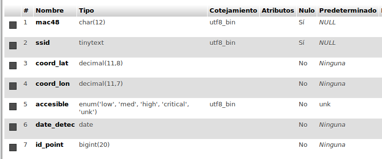

# wi-fly
Wifi access points explorer

Needed apis:
 - Google maps
 - Wifi state
 - Data bases
 - location services

How to detect the geographic point where the signal must be stored as a point:
The proposed solution is to take the point where the intensity of the signal
has its highest value. i.e. when starts to decrease.

# TODO:
Point by Point:
  - Obtener el mapa con un boton generar un marcador y almacenarlo
  - Generar una REST api para pruebas de los puntos
  - Generar un DB y almcacener los SSIDs

  src/main/AndroidManifest.xml:23


## Web service:

Deployed localy with bitnami.
[http://localhost:8080]( http://localhost:8080)

The php app is stored in the installation dir of bitnami:
`/installdir/apache2/htdocs`

it is neccesary to copy the php application in this path.


For the DB this is the first attempt:
```mysql
CREATE TABLE `wifly_test`.`wifly_points` ( `mac48` CHAR(12) UNSIGNED NULL DEFAULT NULL ,
`ssid` TINYTEXT NOT NULL DEFAULT 'UNK' ,
`coord_lat` DECIMAL(10,8) NOT NULL , `coord_lon` DECIMAL(10,8) NOT NULL ,
`accesible` ENUM('low','med','high','critical','unk') NOT NULL DEFAULT 'unk' ,
 `date_detec` DATE NOT NULL , `id_point` BIGINT NOT NULL ) ENGINE = InnoDB;
```

After fix two errors
```mysql
CREATE TABLE `wifly_test`.`wifly_points` ( `mac48` CHAR(12) NULL DEFAULT NULL ,
`ssid` TINYTEXT NULL DEFAULT NULL ,  `coord_lat` DECIMAL(10,8) NOT NULL ,
`coord_lon` DECIMAL(10,8) NOT NULL ,  
`accesible` ENUM('low','med','high','critical','unk') NOT NULL DEFAULT 'unk' ,
`date_detec` DATE NOT NULL ,  `id_point` BIGINT NOT NULL ) ENGINE = InnoDB;
```

To insert some test data into the DB:
```mysql

INSERT INTO `wifly_points` (`mac48`, `ssid`, `coord_lat`, `coord_lon`, `accesible`, `date_detec`, `id_point`) VALUES ('aabbccddeeff', 'infinitum445544', '20.700616', '-103.326117', 'high', '2016-04-12', '3');
```

### Modification for type of values in table:
[src](http://stackoverflow.com/questions/12504208/what-mysql-data-type-should-be-used-for-latitude-longitude-with-8-decimal-places)
<br>
DECIMAL is the MySQL data-type for exact arithmetic. Unlike FLOAT its precision is fixed for any size of number, so by using it instead of FLOAT you might avoid precision errors when doing some calculations. If you were just storing and retrieving the numbers without calculation then in practice FLOAT would be safe, although there's no harm in using DECIMAL. With calculations FLOAT is still mostly ok, but to be absolutely sure of 8d.p. precision you should use DECIMAL.

Latitudes range from -90 to +90 (degrees), so DECIMAL(10, 8) is ok for that, but longitudes range from -180 to +180 (degrees) so you need DECIMAL(11, 8). The first number is the total number of digits stored, and the second is the number after the decimal point.

In short: lat DECIMAL(10, 8) NOT NULL, lng DECIMAL(11, 8) NOT NULL




## hacer el id_point como unico
```mysql
ALTER TABLE `wifly_points` ADD UNIQUE(`id_point`);
```

## Brief introduction on Android Architecture

### References
[Clean Architecture](https://github.com/android10/Android-CleanArchitecture)
